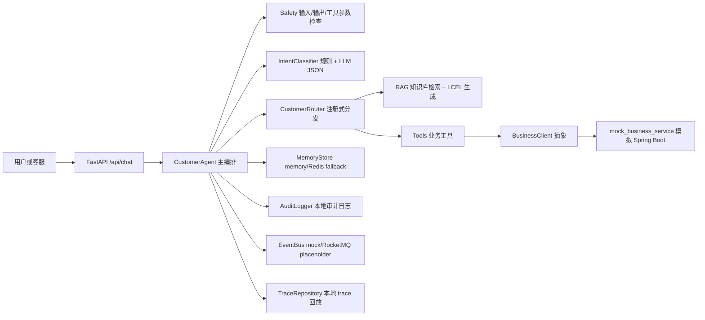

# 企业级 AI 客服问答系统 Demo

## 项目定位

这是一个用于 Agent 开发岗位面试展示的企业级 AI 客服问答系统 Demo。它不是普通 ChatBot，而是在原有 Java/Spring Boot 主业务系统旁边新增一层 Python/FastAPI AI 服务，模拟“业务微服务 + AI 服务层（LLM + Agent）”融合架构。

当前已完成第 13 阶段：简历成果映射与真实接入路线图。项目默认本地模式不依赖真实 LLM、真实 RocketMQ、真实 Redis 或真实数据库，可以用 mock/fallback 跑通完整主链路；后续阶段按“真实接入优先，fallback 保底”的原则逐步接入 Milvus、BGE、Reranker、RocketMQ、Offer/Order 和 Prometheus-compatible metrics。

## 背景痛点

传统客服系统通常面临三个问题：

1. FAQ、套餐、账单、故障、工单分散在不同系统，客服需要手动切换。
2. 大模型能回答自然语言问题，但如果没有权限、工具、安全和审计边界，很难接入真实业务。
3. 面试项目如果只做聊天接口，很难体现 Agent 工程化能力。

本项目的核心目标是展示：如何把 RAG、LLM、Intent Router、工具调用、RBAC、安全、审计、事件和可观测性整合到一条可运行的企业客服链路中。

## 总体架构



## 技术栈

| 类型 | 当前 Demo 实现 |
|---|---|
| Web 框架 | FastAPI |
| Agent 编排 | `CustomerAgent` 自定义主编排 |
| 意图识别 | 规则预分类 + LLM 结构化 JSON，默认 MockLLM |
| RAG | Markdown/TXT 知识库、清洗、分块、MockEmbedding、本地 vector store、sources 返回 |
| LLM 链路 | LangChain LCEL，支持 mock、DashScope qwen-plus、OpenAI-compatible |
| 业务工具 | `BusinessClient` 抽象，HTTP client + 本地 mock fallback |
| 会话记忆 | 内存版默认，Redis 可选，Redis 不可用自动 fallback |
| 权限审计 | RBAC、AuditLogger、本地 JSON Lines 审计日志 |
| 内容安全 | 规则、正则、Mock 语义检测、review queue、脱敏 |
| 事件机制 | EventBus、MockEventProducer、RocketMQProducer placeholder |
| 可观测性 | trace/span/event/attribute、trace 回放、metrics-lite、evals |
| 部署 | Dockerfile、docker-compose、health/ready、smoke/load 脚本 |

说明：Milvus、Redis Cluster、真实 RocketMQ、Prometheus/Grafana/OpenTelemetry Collector 都是生产环境可扩展方向，当前 Demo 没有默认接入这些外部系统。

## 目录结构

```text
app/
  api/               FastAPI 路由，保持薄封装
  agents/            CustomerAgent、Intent、Router、LCEL chain
  rag/               知识库加载、清洗、分块、检索、缓存
  llm/               LLM provider 抽象与 mock fallback
  tools/             业务工具与 BusinessClient 边界
  memory/            会话记忆、Redis fallback、summary、key_facts
  auth/              RBAC、权限与 AuthContext
  audit/             审计日志
  safety/            输入、输出、工具参数安全防护
  events/            事件模型、producer 抽象、mock producer、MQ placeholder
  observability/     trace、日志、metrics-lite、LLM usage
  health/            health/ready 依赖检查
data/knowledge/      客服知识库 Markdown
docs/                第 12 阶段面试交付材料
evals/               离线评测数据集、指标与报告
mock_business_service/ 模拟原有 Spring Boot 内部业务服务
scripts/             入库、冒烟、评测、演示辅助脚本
tests/               pytest 测试
```

## 核心链路

```text
POST /api/chat
  -> api/chat.py 参数校验
  -> customer_agent.py 主编排
  -> safety 输入安全检查
  -> memory 加载最近上下文、summary、key_facts
  -> query_rewriter 基础指代消解
  -> intent_classifier 规则 + LLM 结构化识别
  -> auth 构造 AuthContext
  -> confidence 低置信度兜底
  -> router.py 按 intent 分发
  -> RAG 或业务工具调用
  -> 工具调用前 RBAC + 参数安全检查
  -> 输出安全检查
  -> memory 写入
  -> audit/event/trace 记录
  -> 返回结构化 ChatResponse
```

响应核心字段：

```text
answer, intent, slots, confidence, intent_reason,
sources, tool_calls, trace_id, latency_ms,
rewritten_query, safety_result, error
```

## 业务场景

当前支持 12 类意图：

| 意图 | 示例 | 当前链路 |
|---|---|---|
| `faq_query` | 套餐变更什么时候生效？ | RAG |
| `package_query` | 查询我的当前套餐 | 业务工具 |
| `package_recommend` | 推荐一个流量套餐 | RAG |
| `package_change` | 我要办理 5G 畅享套餐 | 业务工具 |
| `bill_query` | 帮我查本月账单 | 业务工具 |
| `bill_explain` | 为什么有超量流量费？ | RAG |
| `fault_diagnosis` | 宽带连不上怎么排查？ | RAG |
| `network_repair` | 我要报修宽带断网 | 工单工具 |
| `ticket_create` | 创建宽带故障工单 | 工单工具 |
| `ticket_query` | 查工单进度 | 工单工具 |
| `human_transfer` | 转人工客服 | 兜底文案 |
| `unknown` | 无法识别的问题 | 澄清问题 |

## RAG

RAG 层从 `data/knowledge/` 加载 Markdown/TXT，经过清洗、分块、embedding、vector store 检索后返回 `sources`。LCEL 链路只在 sources 存在时生成答案，资料不足时直接兜底转人工，避免模型编造套餐、费用或赔偿承诺。

详细说明见 [docs/rag_design.md](docs/rag_design.md)。

## LLM + LCEL

默认使用 `MockLLM`，无需 API Key。可通过 OpenAI-compatible 配置接入 qwen-plus 或其他兼容模型。真实模型不可用时会 fallback 到 mock，保证本地最小链路可运行。

```bash
LLM_PROVIDER=mock
```

## Intent Router

意图识别采用两阶段策略：高确定性规则命中直接返回，低确定性问题交给 LLM 输出结构化 JSON，再经过 intent 白名单和 Pydantic 校验。Router 使用注册式路由表，新增意图只需新增 handler 并注册。

详细说明见 [docs/agent_router_design.md](docs/agent_router_design.md)。

## Tools + Spring Boot 边界

AI 服务不直接读写业务数据库。套餐、账单、用户、工单能力都通过 `BusinessClient` 调用业务系统。当前仓库提供 `mock_business_service/` 模拟原有 Spring Boot 内部 HTTP API；当 `BUSINESS_SERVICE_BASE_URL` 为空时，工具层走本地 `MockBusinessClient` fallback。

详细说明见 [docs/tool_calling_design.md](docs/tool_calling_design.md)。

## Memory

会话记忆按 `user_id + session_id` 隔离，支持最近 8 轮上下文、summary buffer 和安全白名单 `key_facts`。默认使用内存存储；配置 Redis 后可使用 Redis，但 Redis 不可用时自动降级到内存。

详细说明见 [docs/memory_design.md](docs/memory_design.md)。

## RBAC + Audit

系统支持 `user`、`agent`、`admin` 三类角色。普通用户只能访问自己，客服代查必须提供 `target_user_id`，敏感业务操作写入 `logs/audit.log`，并对用户标识、手机号、身份证、银行卡、邮箱等字段脱敏。

详细说明见 [docs/security_design.md](docs/security_design.md)。

## Safety

安全层覆盖输入、输出和工具参数。高风险内容不进入 LLM 或业务工具，中高风险事件写入本地 `logs/review_queue.jsonl`，并发布 `SAFETY_REVIEW_REQUIRED` 事件。当前语义检测是 Mock 版本，不接真实安全审核模型。

## Events

事件层提供统一事件模型和 Producer 抽象。当前默认 `MockEventProducer` 写入 `logs/events.jsonl`；`RocketMQProducer` 是 placeholder，用来说明生产环境扩展边界，不会连接真实 RocketMQ。

## Observability + Eval

每次 `/api/chat` 会生成 `trace_id`，并把 span、event、attribute 写入 `logs/traces/{trace_id}.json`。可通过 `GET /api/traces/{trace_id}` 回放本地 trace。`/metrics-lite` 提供单进程轻量指标；`evals/` 提供离线评测数据集和报告生成。

详细说明见 [docs/observability_design.md](docs/observability_design.md)。

## Performance + Deployment

第 11 阶段提供了 Dockerfile、docker-compose、health/ready、metrics-lite、业务 HTTP client 连接复用、retry/backoff、简化 circuit breaker，以及 RAG sources TTL 缓存。当前只用于本地演示和小规模验证，不给出生产环境容量承诺。

详细说明见 [docs/deployment_design.md](docs/deployment_design.md)。

## 启动方式

安装依赖：

```bash
pip install -r requirements.txt
```

最小本地模式：

```bash
uvicorn app.main:app --reload
```

Windows 辅助脚本：

```powershell
powershell -ExecutionPolicy Bypass -File scripts/dev_start.ps1
```

Linux/macOS 辅助脚本：

```bash
bash scripts/dev_start.sh
```

Docker Compose：

```bash
docker compose up -d
docker compose ps
```

健康检查：

```text
http://127.0.0.1:8000/health
http://127.0.0.1:8000/ready
http://127.0.0.1:8000/metrics-lite
```

接口文档：

```text
http://127.0.0.1:8000/docs
```

## 验收命令

```bash
pytest
python scripts/smoke_test.py --base-url http://127.0.0.1:8000
python evals/run_eval.py --base-url http://127.0.0.1:8000
python scripts/simple_load_test.py --base-url http://127.0.0.1:8000 --scenario faq --concurrency 5 --total-requests 20
```

Windows：

```powershell
powershell -ExecutionPolicy Bypass -File scripts/run_tests.ps1
powershell -ExecutionPolicy Bypass -File scripts/demo_check.ps1
```

## Demo 案例

套餐规则咨询：

```bash
curl.exe -X POST "http://127.0.0.1:8000/api/chat" -H "Content-Type: application/json" -d "{\"user_id\":\"u1001\",\"session_id\":\"demo-faq\",\"role\":\"user\",\"message\":\"套餐变更什么时候生效？\"}"
```

当前套餐查询：

```bash
curl.exe -X POST "http://127.0.0.1:8000/api/chat" -H "Content-Type: application/json" -d "{\"user_id\":\"u1001\",\"session_id\":\"demo-package\",\"role\":\"user\",\"message\":\"查询我的当前套餐\"}"
```

客服代查账单：

```bash
curl.exe -X POST "http://127.0.0.1:8000/api/chat" -H "Content-Type: application/json" -d "{\"user_id\":\"agent001\",\"session_id\":\"demo-agent-bill\",\"role\":\"agent\",\"target_user_id\":\"u1002\",\"message\":\"帮客户查本月账单\"}"
```

完整演示脚本见 [docs/demo_script.md](docs/demo_script.md)。

## 面试讲解点

推荐讲法：

1. 先强调项目不是普通 ChatBot，而是 AI 服务层接入原有业务系统。
2. 再讲 `/api/chat` 如何经过安全、记忆、意图、权限、Router、RAG/Tools、审计、事件和 trace。
3. 用 5 个 Demo 案例展示 `sources`、`tool_calls`、`audit_logged`、`trace_id`、`safety_result`。
4. 主动说明当前 Demo 的 mock/fallback/placeholder 边界，避免夸大能力。

面试话术见 [docs/interview_guide.md](docs/interview_guide.md)。

## 简历映射说明

第 13 阶段新增 [docs/resume_mapping.md](docs/resume_mapping.md)，用于把简历中的生产项目能力、当前仓库已实现能力、mock/fallback/placeholder 边界和第 14-18 阶段真实接入路线逐项对齐。面试时建议先讲真实生产项目，再说明当前仓库是脱敏后的可运行复现版本，后续会按真实接入路线补齐外部系统。

## 项目阶段

1. 最小可运行企业骨架
2. RAG 知识库链路
3. LLM + LCEL 生成链路
4. 意图识别与多场景 Router
5. 业务工具调用与 Spring Boot 边界
6. Redis 会话记忆与多轮上下文
7. RBAC 权限控制与审计日志
8. 内容安全防护体系
9. RocketMQ 异步解耦与事件机制
10. 可观测性与 AI 效果评测体系
11. 性能优化与部署
12. 面试交付材料
13. 简历成果映射与真实接入路线图
14. RAG 真实检索增强：零宽断言分块、MMR、Reranker 抽象、BGE、Milvus
15. AI 评测体系增强：TopK、幻觉、意图、工具、安全、延迟、Token 成本
16. Offer / Order 业务域增强
17. 性能与可观测性增强：Prometheus-compatible `/metrics`、性能报告、trace latency
18. 最终面试演示闭环

## 后续可扩展方向

这些是后续真实接入方向，不代表当前本地模式已经默认连接外部系统：

1. Redis Cluster 替换单机 Redis 或 memory fallback。
2. Milvus 或企业向量库替换本地 mock/chroma vector store。
3. 真实 RocketMQ Producer 替换当前 placeholder。
4. Prometheus、Grafana、OpenTelemetry Collector 接入完整监控链路。
5. 真实安全审核模型替换 Mock 语义检测。
6. BGE Embedding、MMR 和 BGE-Reranker 补齐生产 RAG 优化链路。
7. Offer / Order 等业务域通过业务微服务 API 接入，不让 AI 服务直连业务库。
8. 更完整的离线评测、在线反馈和人工审核后台。
