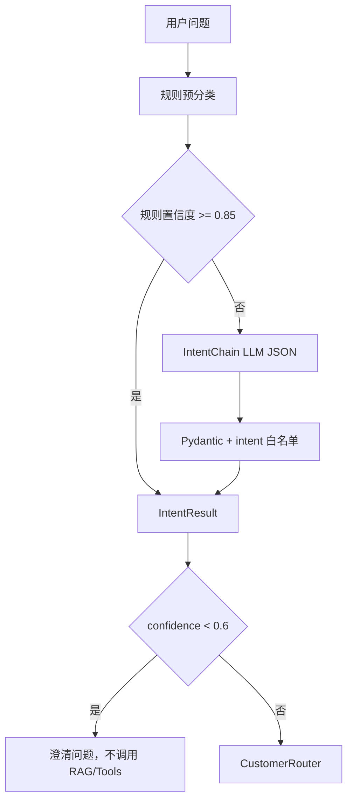

# Agent Router 设计说明

## 目标

意图识别与 Router 的目标是把自然语言问题稳定地分发到正确链路：知识类问题走 RAG，业务数据和操作类问题走工具，低置信度问题先澄清，不盲目调用工具。

## 意图识别链路图



## 12 类 intent

| intent | 说明 | 默认链路 |
|---|---|---|
| `faq_query` | 规则、政策、通用咨询 | RAG |
| `package_query` | 当前套餐查询 | Tool |
| `package_recommend` | 套餐推荐 | RAG |
| `package_change` | 套餐办理或变更 | Tool |
| `bill_query` | 账单查询 | Tool |
| `bill_explain` | 账单规则解释 | RAG |
| `fault_diagnosis` | 故障排查 | RAG |
| `network_repair` | 网络报修 | Tool |
| `ticket_create` | 创建工单 | Tool |
| `ticket_query` | 查询工单 | Tool |
| `human_transfer` | 转人工 | 兜底 |
| `unknown` | 未知诉求 | 澄清 |

## slots 设计

常见 slots：

```text
month, target_package, issue_type, ticket_id,
phone_number, product_name, target_user_id
```

slots 用于两个场景：

1. 工具调用参数，例如账单月份、目标套餐、工单号。
2. 权限上下文，例如客服代查时的 `target_user_id`。

## Router 设计

`CustomerRouter` 使用注册式路由表：

```text
intent -> handler
```

这样设计的原因：

1. 新增意图时只需要新增 handler 和注册项。
2. 避免主分发逻辑变成一长串 `if/else`。
3. 每个 handler 可以独立声明工具、权限和审计动作。
4. RAG 链路和 Tool 链路的边界更清楚。

## 低置信度兜底

当 `confidence < INTENT_LOW_CONFIDENCE_THRESHOLD` 时，系统返回澄清问题，不调用 RAG 或业务工具。这样可以降低误识别带来的业务风险，尤其是账单、套餐变更、工单创建等敏感场景。

## 与 CustomerAgent 的关系

`CustomerAgent` 负责主编排：

1. 输入安全。
2. 加载 memory。
3. query rewrite。
4. 意图识别。
5. 构造 AuthContext。
6. 调用 Router。
7. 输出安全、审计、事件、trace 收口。

`Router` 只负责根据 intent 分发，不负责 FastAPI 请求、事件投递或 trace 持久化。

