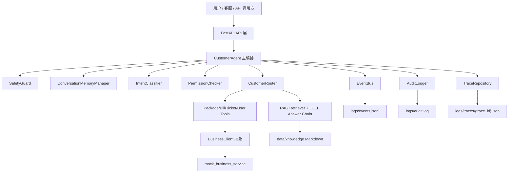
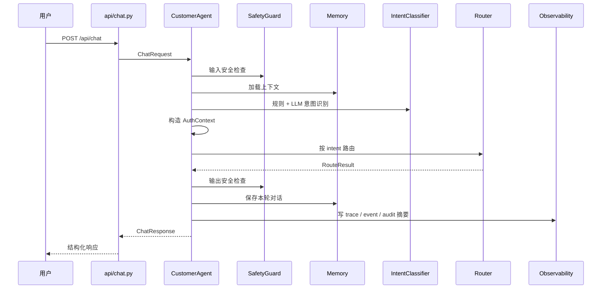

# 架构说明

## 定位

本项目模拟企业里常见的“原有 Spring Boot 主业务系统 + 新增 Python/FastAPI AI 服务层”。AI 服务负责自然语言理解、Agent 编排、RAG、工具调用、安全和观测；用户、套餐、账单、工单等业务数据仍属于业务系统边界。

当前 Demo 默认使用 mock/fallback 跑通链路，不依赖真实 LLM、真实 RocketMQ、真实 Redis 或真实数据库。

## 总体架构图

## 模块职责

| 模块 | 职责 | 边界 |
|---|---|---|
| `app/api/` | 请求接收、参数校验、返回响应 | 不写业务逻辑 |
| `app/agents/customer_agent.py` | 主编排 | 串联安全、记忆、意图、权限、Router、事件和 trace |
| `app/agents/router.py` | 根据 intent 分发 | 不直接操作数据库，不直接发 MQ |
| `app/rag/` | 知识库加载、分块、检索、sources | 不访问业务系统数据 |
| `app/tools/` | 模拟或调用业务系统能力 | 只通过 `BusinessClient` 边界访问 |
| `app/memory/` | 会话记忆 | 按 `user_id + session_id` 隔离 |
| `app/auth/` | RBAC 权限 | 在业务工具调用前校验 |
| `app/audit/` | 审计日志 | 不替代 trace 或 event |
| `app/safety/` | 输入、输出、工具参数安全 | 高风险不进入 LLM 或工具 |
| `app/events/` | 业务事件模型和 Producer 抽象 | 默认 mock，RocketMQ 是 placeholder |
| `app/observability/` | trace、日志、指标、LLM usage | 当前是本地轻量实现 |

## /api/chat 主链路图

## 为什么不是普通 ChatBot

普通 ChatBot 的核心是“输入一句话，模型回答一句话”。本项目的核心是“把 AI 作为服务层接入业务系统”：

1. 用户问题先经过安全和权限边界。
2. 意图识别结果决定进入 RAG 还是业务工具。
3. 工具调用前检查 RBAC 和参数安全。
4. 业务数据通过 mock Spring Boot 内部 API 获取，不在 AI 服务内写死。
5. 每次请求都有 `trace_id`、`tool_calls`、`sources`、审计日志和事件记录。
6. 默认本地可运行，同时保留生产环境替换点。

## 当前能力边界

当前已经实现的是企业级 Demo 的工程骨架和本地可运行链路，不应夸大为生产系统：

1. RocketMQ 当前是 placeholder，不连接真实 NameServer。
2. Milvus 已有可配置适配，本地默认使用 mock vector store，未配置或连接失败会自动 fallback。
3. Redis 可选，默认 memory fallback。
4. Prometheus/Grafana/OpenTelemetry Collector 未默认接入。
5. `metrics-lite` 和 `/metrics` 都是单进程内存指标导出，不是完整生产监控系统。
6. `simple_load_test.py` 只做本地小规模验证，不代表生产级高并发。
