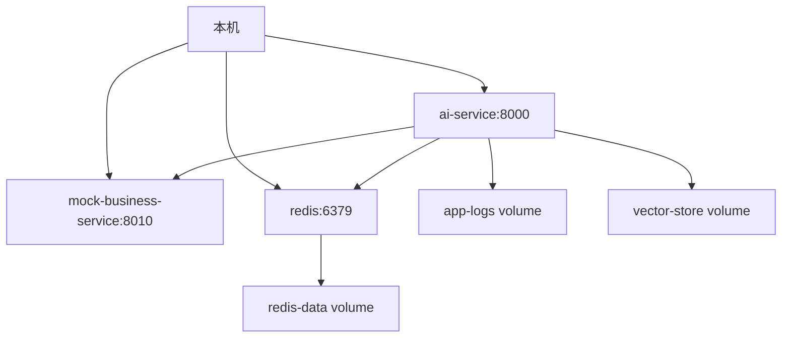

# 部署设计说明

## 目标

第 11 阶段已经让项目具备本地部署和面试演示能力。第 18 阶段只整理最终演示闭环和验证命令，不引入复杂进程管理。

## Docker Compose 部署图



## 本地最小模式

只启动 AI 服务：

```bash
pip install -r requirements.txt
uvicorn app.main:app --reload
```

此时：

1. `LLM_PROVIDER=mock`。
2. `MEMORY_BACKEND=memory`。
3. `EVENT_PRODUCER=mock`。
4. `BUSINESS_SERVICE_BASE_URL` 为空，业务工具走 `MockBusinessClient`。

## 双服务模式

模拟 AI 服务调用原有 Spring Boot 业务系统：

```bash
uvicorn mock_business_service.main:app --host 127.0.0.1 --port 8010
```

另开终端：

```bash
$env:BUSINESS_SERVICE_BASE_URL="http://127.0.0.1:8010"
uvicorn app.main:app --reload
```

## Docker Compose

```bash
docker compose up -d
docker compose ps
docker compose logs ai-service
```

Compose 默认启动：

1. `ai-service`
2. `mock-business-service`
3. `redis`

## 健康检查

| 接口 | 说明 |
|---|---|
| `GET /health` | 应用进程存活 |
| `GET /ready` | 依赖就绪检查 |
| `GET /metrics-lite` | 单进程轻量指标 |
| `GET /metrics` | Prometheus-compatible 文本指标，当前仍是单进程内存导出 |

`/ready` 会检查 app、memory backend、business service、vector store、LLM provider、event producer 和 trace storage。Redis、LLM、事件生产者属于可降级依赖；显式配置业务服务后，业务服务不可用会让 readiness 失败。

## 脚本

| 脚本 | 用途 |
|---|---|
| `scripts/dev_start.sh` | Linux/macOS 本地启动 |
| `scripts/dev_start.ps1` | Windows 本地启动 |
| `scripts/run_tests.sh` | Linux/macOS 运行 pytest |
| `scripts/run_tests.ps1` | Windows 运行 pytest |
| `scripts/run_eval.sh` | Linux/macOS 运行评测 |
| `scripts/demo_check.ps1` | Windows 演示前核心检查 |
| `scripts/final_demo_check.py` | 第 18 阶段最终演示轻量闭环检查 |
| `scripts/smoke_test.py` | 服务启动后的冒烟验证 |
| `scripts/simple_load_test.py` | 本地小规模并发验证，输出 JSON/Markdown 性能报告 |

这些脚本只做简单命令封装，不引入复杂进程管理。

## 本地压测与报告

第 17 阶段增强本地压测脚本：

```bash
python scripts/simple_load_test.py --base-url http://127.0.0.1:8000 --scenario mixed --concurrency 5 --total-requests 20 --report reports/load_test_report.json --markdown-report reports/load_test_report.md
```

支持场景：

| scenario | 说明 |
|---|---|
| `faq` | RAG FAQ 链路 |
| `package` | 套餐工具查询链路 |
| `offer` | Offer 推荐工具链路 |
| `order` | 客服代查订单链路 |
| `mixed` | 多场景混合请求 |

报告指标包括 avg、p50、p95、max、success_rate、error_rate、intent 分布、status_code 分布和错误摘要。该脚本只用于本机 Demo 验证，不代表生产容量、生产 SLA 或线上高并发能力。

## 监控边界

`/metrics` 使用 Prometheus 兼容文本格式，便于后续接入真实 Prometheus/Grafana。当前仓库没有默认启动 Prometheus、Grafana 或 OTel Collector，也不处理多进程指标聚合、长期存储、告警规则和容量规划。

## 当前边界

1. 不声称支持生产级高并发。
2. 不默认启动 Milvus、Prometheus、Grafana 或 OTel Collector。
3. RocketMQ 当前是 placeholder。
4. `simple_load_test.py` 只用于本地小流量验证，报告不作为生产容量承诺。
