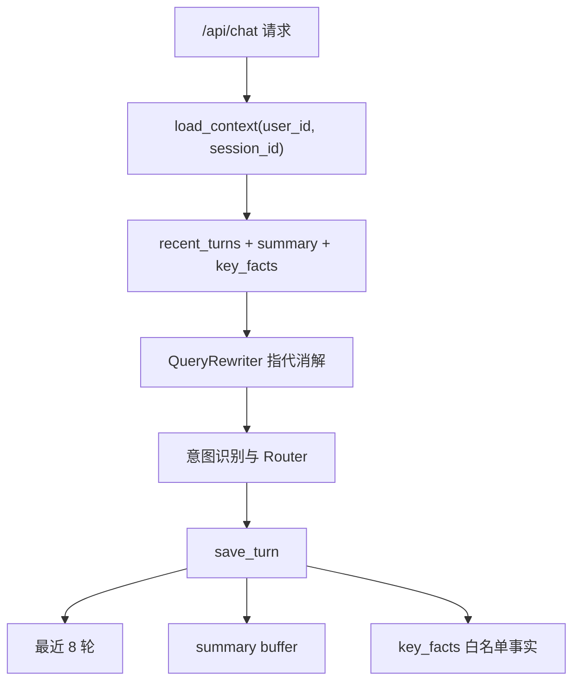

# 会话记忆设计

## 目标

会话记忆用于支持多轮客服对话，例如用户先查询套餐，再追问“这个套餐什么时候生效”。设计重点是会话隔离、隐私控制和外部依赖 fallback。

## 多轮记忆链路图



## 隔离维度

Memory key 使用：

```text
user_id + session_id
```

原因：

1. 只用 `session_id` 容易不同用户串话。
2. 只用 `user_id` 无法区分同一用户的多个会话。
3. 生产多实例部署时需要外部存储共享上下文。

## 当前存储

| 存储 | 当前状态 |
|---|---|
| `InMemoryMemoryStore` | 默认本地 fallback |
| `RedisMemory` | 可选启用 |
| `FallbackMemoryStore` | Redis 失败时自动切到 memory |

默认配置：

```bash
MEMORY_BACKEND=memory
MEMORY_RECENT_TURNS=8
MEMORY_TTL_SECONDS=604800
```

## key_facts

`key_facts` 只保存白名单业务事实，例如：

1. 当前套餐。
2. 最近账单月份。
3. 最近工单号。
4. 最近目标套餐。

不应长期保存手机号、身份证、银行卡、邮箱等隐私字段。保存前会经过隐私清洗。

## QueryRewriter

当前使用高置信规则做基础指代消解：

| 原问题 | 可改写为 |
|---|---|
| 这个套餐什么时候生效？ | 5G畅享套餐什么时候生效？ |
| 刚才那个工单进度怎么样？ | 工单 TCK-xxx 进度怎么样？ |
| 这笔费用为什么会有超量流量费？ | 本月账单费用为什么会有超量流量费？ |

这样设计比直接让 LLM 自由改写更可控，也更容易测试。

## 生产扩展

生产环境可以扩展为 Redis Cluster、会话摘要模型、更精细的隐私策略和上下文压缩策略。当前 Demo 只实现轻量可运行版本。

