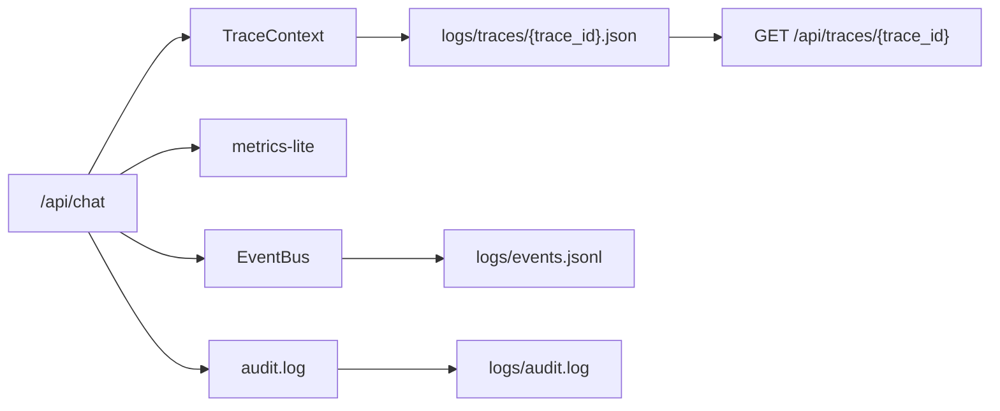

# 可观测性与评测设计

## 目标

Agent 系统的问题排查比普通接口更复杂，因为一次请求可能包含意图识别、RAG、LLM、工具调用、安全、事件和记忆读写。本项目用轻量 trace 把每轮执行过程记录下来，方便本地演示和问题复盘。

## 事件与可观测性链路图



## Trace 记录内容

trace 中包含：

1. `trace_id`、请求耗时、角色、session。
2. intent、slots、confidence、intent_reason。
3. memory backend、读写耗时、summary/key_facts 状态。
4. query rewrite 结果。
5. RAG source 数量、doc_ids、scores、cache_hit、vector_store_type、embedding_provider、candidate_count、mmr_enabled、reranker_used、reranker_type、final_top_k。
6. LLM provider、model、估算 token、fallback 状态。
7. tool_calls、权限、审计、工具耗时。
8. input/output/tool safety 结果。
9. event publish 结果。

## Trace 回放

每次请求会写入：

```text
logs/traces/{trace_id}.json
```

可通过接口回放：

```bash
curl.exe "http://127.0.0.1:8000/api/traces/{trace_id}"
```

这适合面试演示：先调用 `/api/chat`，拿到 `trace_id`，再展示完整 Agent 执行过程。

## metrics-lite

`GET /metrics-lite` 返回单进程内存指标，包括请求数、成功率、平均耗时、P95 等。它是本地演示用轻量指标，不是 Prometheus 替代品。

## 事件和 trace 的区别

| 类型 | 目的 |
|---|---|
| trace | 调试单次 Agent 执行过程 |
| audit | 留存敏感业务操作审计证据 |
| event | 模拟跨系统异步解耦 |
| metrics-lite | 本地观察接口整体健康度 |

## 离线评测

`evals/` 包含：

1. `datasets/customer_qa_eval.jsonl`：JSONL 评测数据集，支持 `scenario`、`expected_sources`、`expected_top_k`、`expected_rerank`、`expected_tool` 和 `safety_expected_action`。
2. `schema.py`：集中做数据集加载、字段默认值和第 10 阶段旧字段兼容。
3. `metrics.py`：计算 Top1/Top3/TopK、source coverage、Rerank 期望、intent、tool、安全动作、简化疑似幻觉、延迟和估算 Token/成本。
4. `run_eval.py`：批量调用 `/api/chat`，并尽力通过 `trace_id` 读取 `/api/traces/{trace_id}` 补充 rerank 和 token/cost 字段；trace 读取失败时 fallback 到 response-only。
5. `reports/`：输出 JSON 和 Markdown 报告。

运行：

```bash
python evals/run_eval.py --base-url http://127.0.0.1:8000
```

如果只想依赖 `/api/chat` 响应，不读取 trace，可运行：

```bash
python evals/run_eval.py --base-url http://127.0.0.1:8000 --no-trace
```

### 第 15 阶段指标说明

| 指标 | 本地 Demo 口径 |
|---|---|
| Top1/Top3/TopK | 对带 `expected_sources` 的 RAG 用例，检查期望文档是否出现在响应 sources 前 1/3/K 个结果中 |
| Source coverage | 命中的 expected source 数量 / expected source 总数 |
| Rerank 期望 | 根据 trace 中的 `rag_retrieval_config` 和 sources metadata 判断 reranker 是否符合预期 |
| 简化疑似幻觉 | 需要 sources 但缺失、source coverage 为 0、缺少必要关键词或出现禁用承诺词时标记 |
| Intent accuracy | 响应 `intent` 与 `expected_intent` 是否一致 |
| Tool call accuracy | `tool_calls` 是否包含期望工具，且成功状态符合预期 |
| Safety action accuracy | 输入/输出/工具安全动作是否符合 `safety_expected_action` |
| Latency | eval 样本中的平均、P50、P95、最大耗时 |
| Token / cost | 优先读取 trace 中估算 usage；mock 模式下不是供应商账单 |

这些指标服务于本地 Demo 和面试讲解，不代表生产项目历史指标。生产中的 TopK、幻觉率、延迟和成本需要更大的标注集、真实模型 usage、线上监控和人工质检闭环。

## 生产扩展

生产环境可把当前 trace 字段映射到 OpenTelemetry，把 metrics 接到 Prometheus/Grafana，把 event 接入真实 MQ，把 eval 接入持续回归评测和人工质检流程。当前 Demo 没有接入完整 OTel Collector、生产监控系统或真实质检平台。
