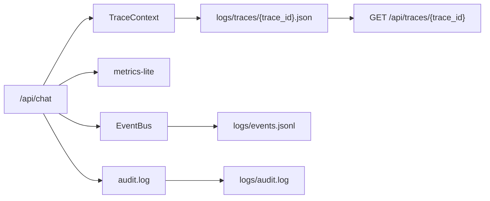

# 可观测性与评测设计

## 目标

Agent 系统的问题排查比普通接口更复杂，因为一次请求可能包含意图识别、RAG、LLM、工具调用、安全、事件和记忆读写。本项目用轻量 trace 把每轮执行过程记录下来，方便本地演示和问题复盘。

## 事件与可观测性链路图



## Trace 记录内容

trace 中包含：

1. `trace_id`、请求耗时、角色、session。
2. intent、slots、confidence、intent_reason。
3. memory backend、读写耗时、summary/key_facts 状态。
4. query rewrite 结果。
5. RAG source 数量、doc_ids、scores、cache_hit、vector_store_type、embedding_provider、candidate_count、mmr_enabled、reranker_used、reranker_type、final_top_k。
6. LLM provider、model、估算 token、fallback 状态。
7. tool_calls、权限、审计、工具耗时。
8. input/output/tool safety 结果。
9. event publish 结果。

## Trace 回放

每次请求会写入：

```text
logs/traces/{trace_id}.json
```

可通过接口回放：

```bash
curl.exe "http://127.0.0.1:8000/api/traces/{trace_id}"
```

这适合面试演示：先调用 `/api/chat`，拿到 `trace_id`，再展示完整 Agent 执行过程。

## metrics-lite

`GET /metrics-lite` 返回单进程内存指标，包括请求数、成功率、平均耗时、P95 等。它是本地演示用轻量指标，不是 Prometheus 替代品。

## 事件和 trace 的区别

| 类型 | 目的 |
|---|---|
| trace | 调试单次 Agent 执行过程 |
| audit | 留存敏感业务操作审计证据 |
| event | 模拟跨系统异步解耦 |
| metrics-lite | 本地观察接口整体健康度 |

## 离线评测

`evals/` 包含：

1. `datasets/customer_qa_eval.jsonl`：评测数据集。
2. `metrics.py`：intent、关键词、sources、tool、安全结果等指标。
3. `run_eval.py`：批量调用 `/api/chat` 并生成报告。
4. `reports/`：JSON 和 Markdown 报告。

运行：

```bash
python evals/run_eval.py --base-url http://127.0.0.1:8000
```

## 生产扩展

生产环境可把当前 trace 字段映射到 OpenTelemetry，把 metrics 接到 Prometheus/Grafana，把 event 接入真实 MQ。当前 Demo 没有接入完整 OTel Collector 或生产监控系统。
