# RAG 设计说明

## 目标

RAG 层负责把客服政策文档转成可检索知识库，并在 FAQ、账单解释、套餐推荐、故障排查等场景中返回可追溯的 `sources`。设计重点是可运行、可解释、可替换，而不是在 Demo 阶段追求复杂向量库能力。

## 检索生成链路图

```mermaid
flowchart LR
    Docs["data/knowledge/*.md"] --> Loader["loader.py"]
    Loader --> Cleaner["cleaner.py"]
    Cleaner --> Splitter["splitter.py"]
    Splitter --> Embedding["embeddings.py"]
    Embedding --> Store["vector_store.py"]
    Store --> Retriever["retriever.py top_k"]
    Retriever --> Sources["sources"]
    Sources --> Chain["rag_answer_chain.py LCEL"]
    Chain --> Answer["answer + sources"]
```



## 当前实现

| 能力 | 当前实现 |
|---|---|
| 文档来源 | `data/knowledge/` 下 Markdown/TXT |
| 文档清洗 | `TextCleaner` 去除多余空白 |
| 分块 | `ChineseTextSplitter`，按中文客服文档长度切分 |
| Embedding | 默认 `MockEmbedding`，可配置 DashScope embedding |
| Vector Store | 默认 `MockVectorStore`，Chroma lazy import，Milvus placeholder |
| 检索 | `KnowledgeRetriever.search()` 返回 top_k sources |
| 生成 | `RagAnswerChain` 使用 LCEL：Prompt -> LLM -> StrOutputParser |
| 兜底 | sources 为空时不调用 LLM，直接建议转人工 |

## sources 设计

接口响应中的每个 source 包含：

```text
doc_id, title, content, score, metadata
```

这样做的原因：

1. 面试演示时可以证明答案来自知识库，不是模型随口生成。
2. trace 中可以记录 `doc_ids`、`scores`、`source_count`。
3. 后续接真实向量库或 reranker 时，接口契约不用改。

## LCEL 生成链路

`app/agents/chains/rag_answer_chain.py` 把检索资料、用户问题、会话上下文、summary 和 key_facts 拼入 Prompt，再通过 LCEL 管道生成回答。

关键约束：

1. 只能基于 sources 回答。
2. 不得编造资费、赔偿、办理承诺。
3. 具体金额、办理结果以业务系统返回为准。
4. 真实 LLM 失败时 fallback 到 `MockLLM`。

## RAG 缓存

第 11 阶段新增了轻量 TTL 缓存，只缓存公开知识库检索结果，不缓存套餐、账单、工单等敏感业务结果。trace 中会记录 `rag_cache_hit`，便于演示缓存是否命中。

## 生产扩展方式

当前 Demo 默认不接真实 Milvus。生产环境可以扩展为：

1. 使用企业文档同步任务更新知识库。
2. 使用真实 embedding 模型替换 MockEmbedding。
3. 使用 Milvus、PGVector 或企业向量库替换本地 store。
4. 增加 reranker、召回融合、知识版本管理。
5. 把评测集扩展为持续回归评测。

这些都是可扩展方向，不代表当前 Demo 已完成真实生产级 RAG 平台。

