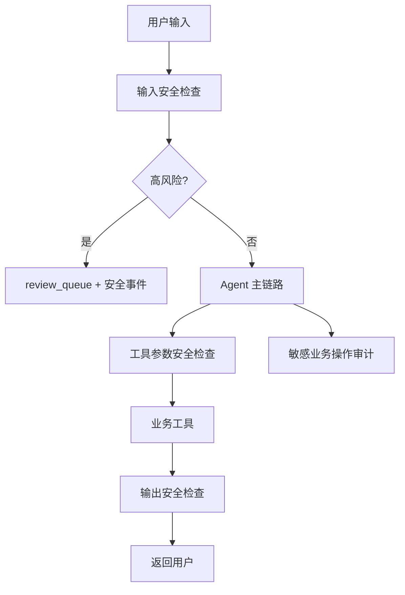

# 权限、安全与审计设计

## 目标

企业客服 Agent 不能只追求回答能力，还必须处理权限、隐私、安全和审计。本项目把 RBAC、内容安全和审计拆成独立层，避免把这些逻辑写到 API 层或工具内部。

## 安全防护链路图



## RBAC

角色：

| 角色 | 权限边界 |
|---|---|
| `user` | 只能访问自己的套餐、账单、工单和套餐变更 |
| `agent` | 可代查和代建工单，必须提供 `target_user_id` |
| `admin` | 拥有更高权限，敏感操作仍写审计 |

权限不是简单 role 判断，而是按业务动作细分，例如：

```text
PACKAGE_QUERY_SELF, PACKAGE_QUERY_AGENT,
BILL_QUERY_SELF, BILL_QUERY_AGENT,
TICKET_CREATE_SELF, TICKET_CREATE_AGENT
```

## 审计日志

敏感业务操作会写入 `logs/audit.log`。字段包括：

```text
trace_id, timestamp, role, actor_user_id_masked,
target_user_id_masked, action, permission, intent,
tool_name, resource_type, allowed, success, reason, metadata
```

审计日志会脱敏用户标识、手机号、身份证、银行卡、邮箱等字段。

## 内容安全

安全检测范围：

1. 输入安全：敏感词、隐私索取、prompt injection、违规请求。
2. 工具参数安全：防止危险参数进入业务工具。
3. 输出安全：防止模型或模板返回未确认承诺、内部数据或高风险内容。

风险等级：

| 等级 | 动作 |
|---|---|
| `SAFE` | 放行 |
| `LOW` | 放行并记录 |
| `MEDIUM` | 转人工审核 |
| `HIGH` | 拦截 |
| `CRITICAL` | 拦截 |

## review_queue

中高风险安全事件会写入 `logs/review_queue.jsonl`。这是本地审核队列，不是完整审核后台。第 9 阶段会额外发布 `SAFETY_REVIEW_REQUIRED` 事件，便于后续扩展人工审核系统。

## 面试讲法

可以这样解释：

> 这个项目不把安全当成一个敏感词函数，而是把输入、工具参数、输出都纳入安全链路。高风险内容不会进入 LLM 或业务工具；业务敏感操作还会走 RBAC 和审计。这样更接近企业客服场景。

