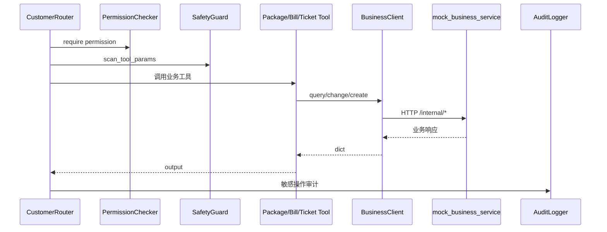

# 工具调用与业务系统边界设计

## 目标

工具调用层用于模拟企业客服系统访问原有业务能力。AI 服务不直接查库、不直接写业务表，而是通过 `BusinessClient` 抽象访问业务系统 API。

## 工具调用链路图



## 当前工具

| 工具 | 业务能力 |
|---|---|
| `PackageTool` | 查询套餐、变更套餐 |
| `BillTool` | 查询账单 |
| `TicketTool` | 创建工单、查询工单 |
| `UserTool` | 查询用户资料 |

## BusinessClient 抽象

`BusinessClient` 有两个主要实现：

1. `HttpBusinessClient`：通过 HTTP 调用 `mock_business_service`，模拟真实 Spring Boot 内部 API。
2. `MockBusinessClient`：本地 fallback，当未配置 `BUSINESS_SERVICE_BASE_URL` 时使用。

这样做的原因：

1. AI 服务不拥有业务数据和事务。
2. 未来替换成真实 Spring Boot 服务时，不需要改 Router 或 Tool 的调用方式。
3. 本地最小模式不依赖业务服务也能演示。

## tool_calls 字段

每次工具调用都会进入响应 `tool_calls`：

```text
tool_name, input, output, success, latency_ms,
error_message, permission, permission_checked, audit_logged
```

这个字段适合面试演示：

1. 证明 Agent 确实调用了工具，而不是模型编造。
2. 展示权限检查和审计结果。
3. 展示业务失败时的降级结果。
4. 帮助定位延迟和错误。

## 失败处理

`HttpBusinessClient` 支持 timeout、retry/backoff、连接复用和简化 circuit breaker。HTTP 错误、业务 4xx/5xx、连接失败会转换成友好的工具失败结果，`/api/chat` 不应因为工具异常直接崩溃。

## 生产边界

当前 `mock_business_service` 是 FastAPI 服务，用来模拟 Spring Boot 内部 API。生产环境可以替换为真实业务服务，但仍应保留以下边界：

1. 权限和审计不可绕过。
2. AI 服务不直接操作业务数据库。
3. 工具调用参数要做安全检测。
4. 业务失败要结构化返回，不能把底层异常直接暴露给用户。

